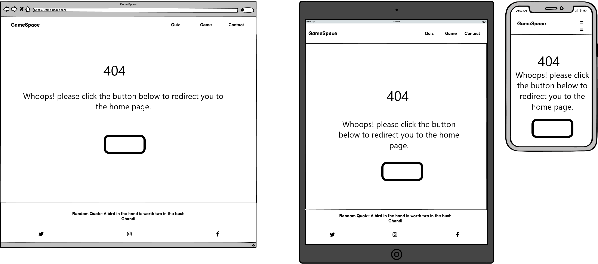

# Game Space
(Developer: Jarrad Baker)

[Live webpage](https://jarradbaker.github.io/CI_PP2_GameSpace/)

## Table Of Contents

1. [Project Goals](#project-goals)
  1. [User Goals](#user-goals)
  2. [Website Owner Goals](#website-owner-goals)
2. [User Experience](#user-experience)
    1. [Target Audience](#target-audience)
    2. [User Requrements and Expectations](#user-requirements-and-expectations)
    3. [User Stories](#user-stories)
3. [Design](#design)
    1. [Design Choices](#design-choices)
    2. [Colour](#colour)
    3. [Fonts](#fonts)
    4. [Structure](#structure)
    5. [Wireframes](#wireframes)
4. [Technologies Used](#technologies-used)
    1. [Languages](#languages)
    2. [Frameworks and Tools](#frameworks-and-tools)
5. [Features](#features)
6. [Testing](#validation)
    1. [HTML Validation](#HTML-validation)
    2. [CSS Validation](#CSS-validation)
    3. [Accessibility](#accessibility)
    4. [Performance](#performance)
    5. [Device testing](#performing-tests-on-various-devices)
    6. [Browser compatibility](#browser-compatability)
    7. [Testing user stories](#testing-user-stories)
8. [Bugs](#Bugs)
9. [Deployment](#deployment)
10. [Credits](#credits)
11. [Acknowledgements](#acknowledgements)

## Project Goals

### User Goals
- Play Naughts and Crosses
- Play a quiz game
- Save their hiscores
- Contact the website about fixes/improvements

### Website Owner Goals
- Reach the target audience
- Direct interaction with users
- Provide games for users

## User Experience

### Target Audience
The website is designed with the following target audience in mind:
- People looking to play a quiz game
- People looking to play Naughts and Crosses
- Peaople looking to play games

### User Requirements and Expectations
- Simplistic user interface
- Smooth Navigation System
- Easy to play the games
- All social links direct to the correct website
- Presentation of content is clear
- Accessibility
- Games work as expected

### User Stories

#### First Time User
1. As a first time user, I want to be able to play Naughts and Crosses
2. As a first time user, I want to be able to play a quiz
3. As a first time user, I want to contact the developer with feedback
4. As a first time user, I want to be able to save my hiscores
5. As a first time user, I want to be able to navigate the site easily

#### Returning User
6. As a returning user, I want to be able to contact the developer with suggested fixes and updates
7. As a returning user, I want to view my hiscores
8. As a returning user, I want to be able to play easily across my devices

#### Site Owner
9. As a site owner, I want users to be able to play the games
10. As a site owner, I want users to be able to save, and show their hiscores
11. As a site owner, I want users to be able to see a 404 page if anything goes wrong
12. As a site owner, I want users to have a good experience.

## Design

### Design Choices
The website was designed to have a simplistic colour theme, which allows the text to be clear, and allow the user to focus more on the games. 

### Colour
As explained above, the colour theme was simplstic, and the font and game colours contrast well with the background colour. I chose a sandy yellow for the background colour, and a red font for headings, links and buttons, and a blue font for more standard text.

Colour

  

### Fonts
I chose the font "orbitron" from google fonts for my logo text, and text for any features, or interactables for the games. I chose this font, as it looks very "futuristic" and "cyber like". This ties in wel with the theme of the site. For standard text I chose the font "lucida sans", as it provides a nice contrast, and is clear.

### Structure
To make navigation as imple as possible, and looking appealing, I used a hamburger nav bar for the mobile view, and a standard styles nav bar for larger screens. I also decided to make the footer appear on mobile devices only when scrolling down, to give the user a better area for the games on smaller screens. The theme remains the same throughout all four pages:
- Index page: Contains the Quiz game, and all of it's different screen states.
- Game page: Contains the Naughts and Crosses game.
- Contact page: Gives users a chance to provide feedback through a contact form.

### Wireframes

Index(Quiz)

  

Game

  

Contact

  

404

  

## Technologies Used

### Languages
The following languages were used to develop the website:
- HTML
- CSS
- Javascript

### Frameworks and Tools
The following frameworks and tools were used to develop the website:
- Git
- Github
- Gitpod
- Google Fonts
- Font Awesome
- Balsamiq
- Favicon.io
- Email.js
- Quotable.io (for the quotes in the footer)

## Features
The website contains 5 pages including the 404 page, and a total of 13 features

### Header (logo and navigation)
- Shows on every page when not on mobile
- Enables easy and smooth navigation
- The current page is highlighted in blue
- User Stories: 5

Header

  

### Hamburger Menu
- Shows on every page when on mobile
- Clicking it shows the nav links
- Enables easy and smooth navigation
- User Stories: 5, 8

Hamburger

  

### Footer
- Shows on every page like the header
- The social links also stack underneath the copyright text on smaller screens
- User Stories: 8, 12

Footer

  

### Random Quote
- Shows on every page
- Is a part of the footer
- Shows a random quote
- User Stories: 8, 12

Random Quote

  

### Quiz Game
- Provides one of the games for the user
- Allows them to interact with the site
- User Stories: 2, 8, 9

Quiz Game

  

### Saving and Showing Hiscores
- Built in to the quiz game
- Allows players to save their score
- Allows returning players to see their Hiscores
- User Stories: 4, 7, 10

Saving and Showing Hiscores

 
 

### Naughts and Crosses Game
- Provides the other game for the user and a friend
- Two player game
- Has a button to reset the game
- User Stories: 1, 8, 9

Naughts and Crosses

  

### Contact form
- Allows users to contact the site owner/developer
- Can be used to provide feedback/suggest improvements
- Located on the contact page
- User Stories: 3, 6

Contact Form

  

### 404 page
- Redirects the user to a working page
- Explains what the issue is
- User Stories: 11, 12

404 Page

  

## Validation

### HTML Validation

The Nu HTML Checker (W3C) is used to validate HTML documents. This ensures that all unintended mistakes are spotted before release, so that they can be corrected. All of my pages passed the check without any errors, including the 404 page.

index.html(quiz) - [results](https://validator.w3.org/nu/?doc=https%3A%2F%2Fjarradbaker.github.io%2FCI_PP2_GameSpace%2Findex.html) - No errors or warnings

game.html(Naughts and Crosses) - [results](https://validator.w3.org/nu/?doc=https%3A%2F%2Fjarradbaker.github.io%2FCI_PP2_GameSpace%2Fgame.html) - No errors or warnings

contact.html(Contact Form) - [results](https://validator.w3.org/nu/?doc=https%3A%2F%2Fjarradbaker.github.io%2FCI_PP2_GameSpace%2Fcontact.html) - No errors or warnings

404.html(404 page) - [results](https://validator.w3.org/nu/?doc=https%3A%2F%2Fjarradbaker.github.io%2FCI_PP2_GameSpace%2F404.html) - No errors or warnings

### CSS Validation

The W3C Jigsaw CSS Validation Service is used in exactly the same way as the Nu HTML Validator, but for CSS. I ran both my actual style.css file, and an actual web page through it, and both passed without any errors.

CSS [results](https://jigsaw.w3.org/css-validator/validator?uri=https%3A%2F%2Fjarradbaker.github.io%2FCI_PP2_GameSpace%2Findex.html&profile=css3svg&usermedium=all&warning=1&vextwarning=&lang=en) - No errors found

### Accessibility

The WAVE web accessibility evaluation tool by WebAIM was used to ensure the webpages met accessibility standards. All 5 pages passed without any errors.

Index(quiz)

Game

Contact

404

### Performance

The Google Lighthouse tool, within the Google Chrome Developer Tools was used to ensure that each page met a high performance rating. This shows that the website will load efficiently over various devices.

Index(quiz)

Game

Contact

404

### Performance tests on various devices

Throughout development and testing, I used the following devices to ensure that the site was responsive, and worked as intended.

- Samsung Galaxy ZFold 2 (both ultra slim mode, and wide mode)
- Microsoft Surface Book 2 (Both as the laptop, and tablet)
- Macbook Pro
- Desktop PC with a 32" monitor

### Browser Compatibility

The website was tested on several web browsers to ensure consistency. The browsers used are as follows:

- Microsoft Edge
- Google Chrome
- Brave Browser (A Chrome based browser)
- Mozilla Firefox
- Opera GX
<!-- Finished here -->
### Testing User Stories

1. As a first time user, I want to be able to play Naughts and Crosses

| **Feature** | **Action** | **Expected Result** | **Actual Result** |
|-------------|------------|---------------------|-------------------|
| Naughts and Crosses | Navigate to the Game page and play the game | Game works as expected | Works as expected |

Screenshots

  

Naughts and Crosses

    
  

2. As a first time user, I want to be able to play a quiz

| **Feature** | **Action** | **Expected Result** | **Actual Result** |
|-------------|------------|---------------------|-------------------|
| Quiz | Navigate to the Quiz page and play the quiz | Game works as expected | Works as expected |

Screenshots

  

Quiz Game

      
  

3. As a first time user, I want to contact the developer with feedback

| **Feature** | **Action** | **Expected Result** | **Actual Result** |
|-------------|------------|---------------------|-------------------|
| Contact Form | Navigate to the Contact page | Fill in the form and it emails the site owner | Works as expected |

Screenshots

  

Contact Form

      
  

4. As a first time user, I want to be able to save my hiscores

| **Feature** | **Action** | **Expected Result** | **Actual Result** |
|-------------|------------|---------------------|-------------------|
| Saving and Showing Hiscores | On the Quiz page either before or after completing quiz, press the Hiscores or Add Hiscores buton | Save and show hiscores | Works as expected |

Screenshots

  

Saving and Showing Hiscores

     
     
  

5. As a first time user, I want to be able to navigate the site easily

| **Feature** | **Action** | **Expected Result** | **Actual Result** |
|-------------|------------|---------------------|-------------------|
| Header | At the top of every page | See the header and navigation links | Works as expected |
| Hamburger Menu | At the top of every page when the screen width is < 501px | See the hamburger menu and interact with it | Works as expected |

Screenshots

  

Header

      
  

  

Hamburger

      
  

6. As a returning user, I want to be able to contact the developer with suggested fixes and updates

| **Feature** | **Action** | **Expected Result** | **Actual Result** |
|-------------|------------|---------------------|-------------------|
| Contact Form | Navigate to the Contact page | Fill in the form and it emails the site owner | Works as expected |

Screenshots

  

Contact Form

      
  

7. As a returning user, I want to view my hiscores

| **Feature** | **Action** | **Expected Result** | **Actual Result** |
|-------------|------------|---------------------|-------------------|
| Saving and Showing Hiscores | On the Quiz page either before or after completing quiz, press the Hiscores or Add Hiscores buton | Save and show hiscores | Works as expected |

Screenshots

  

Saving and Showing Hiscores

     
     
  

8. As a returning user, I want to be able to play easily across my devices

| **Feature** | **Action** | **Expected Result** | **Actual Result** |
|-------------|------------|---------------------|-------------------|
| Hamburger Menu | At the top of every page when the screen width is < 501px | See the hamburger menu and interact with it | Works as expected |
| Footer | At the bottom of every page, and is either visible or you need to scroll depending on screen size | See the Footer | Works as expected |
| Random Quote | At the bottom of every page, as it is part of the footer | See the Random Quotes and Authors | Works as expected |
| Quiz | Navigate to the Quiz page and play the quiz | Game works as expected | Works as expected |
| Naughts and Crosses | Navigate to the Game page and play the game | Game works as expected | Works as expected |

Screenshots

  

Hamburger

      
  

  

Footer

      
  

  

Random Quote

      
  

  

Quiz Game

      
  

  

Naughts and Crosses

    
  

9. As a site owner, I want users to be able to play the games

| **Feature** | **Action** | **Expected Result** | **Actual Result** |
|-------------|------------|---------------------|-------------------|
| Quiz | Navigate to the Quiz page and play the quiz | Game works as expected | Works as expected |
| Naughts and Crosses | Navigate to the Game page and play the game | Game works as expected | Works as expected |

Screenshots

  

Quiz Game

      
  

  

Naughts and Crosses

    
  

10. As a site owner, I want users to be able to save, and show their hiscores

| **Feature** | **Action** | **Expected Result** | **Actual Result** |
|-------------|------------|---------------------|-------------------|
| Saving and Showing Hiscores | On the Quiz page either before or after completing quiz, press the Hiscores or Add Hiscores buton | Save and show hiscores | Works as expected |

Screenshots

  

Saving and Showing Hiscores

     
     
  

11. As a site owner, I want users to be able to see a 404 page if anything goes wrong

| **Feature** | **Action** | **Expected Result** | **Actual Result** |
|-------------|------------|---------------------|-------------------|
| 404 Page | Anything goes wrong, or you miss type the url | See the 404 Page | Works as expected |

Screenshots

  

404 Page

      
  

12. As a site owner, I want users to have a good experience.

| **Feature** | **Action** | **Expected Result** | **Actual Result** |
|-------------|------------|---------------------|-------------------|
| Footer | At the bottom of every page, and is either visible or you need to scroll depending on screen size | See the Footer | Works as expected |
| Random Quote | At the bottom of every page, as it is part of the footer | See the Random Quotes and Authors | Works as expected |
| 404 Page | Anything goes wrong, or you miss type the url | See the 404 Page | Works as expected |

Screenshots

  

Footer

      
  

  

Random Quote

      
  

  

404 Page

      
  

## Bugs

| **Bug** | **Fix** |
|---------|---------|
| 404 page wasn't showing correctly | Added 404.md to redirect users |
| forEach loop for displaying the quiz answers | Assigning them manually was inefficient |
| Contact form sending email when required fields are empty | Ensured that all relevant inputs aren't empty |

## Deployment

The website was deployed through the use of GitHub Pages, a feature built in to GitHub. This can be done by following the steps below.
1. In the desired repository, click on "Settings" from the top menu.
2. From the side menu to your left, select "Pages" in the "Code and automation" section.
3. Make sure the "Source" option is set to "Deploy from a branch"
4. Select the desired "Branch" from the drop down below (main branch in most cases, making sure the director is set to /(root)).
5. Select "Save", and after it refreshes the page, you will see a box at the top of the page providing you with the URL of your now published site.

You can fork my, or any other repository by doing the following.
1. Go to the desired repository
2. Click "Fork" in the upper right corner
3. Select the owner, and set the repository name. A description can be added if desired
4. Choose whether to copy the default branch, or all branches
5. Click "Create Form"

You can clone a repository by following the steps below.
1. Go to the desired repository
2. Click the "Code" button at the top of the files section of the page
3. Select your desired method for cloning (HTTPS/SSH/GitHub CLI)
4. Open Git Bash
5. Change the current working directory to the location where you want the cloned directory
6. Type "git clone", and then paste the URL you copied earlier. It will look like this, with your GitHub username instead of "YOUR-USERNAME": "$ git clone https://github.com/YOUR-USERNAME/DESIRED-REPOSITORY"
7. Press Enter. Your local clone will be created.

## Credits

### Media

### Code

- Some CSS and JS: WebDev Simplified's tutorial for making a tic tac toe game 
- HTML: "i" tags with the icons and the social media link icons were all imported from FontAwesome.
- CSS: The font "Orbitron" was imported from Google Fonts.
- JS: Used EmailJS for emailing the contents of the user form to my email address.
- JS: Used Quotables api for the random quotes.

## Acknowledgements

I would like to take this opportunity to acknowledge and thank the following people:
- My mentor Mo Shami for continuous guidance and support.
- My mother, who always encouraged me to strive for a career that I enjoy.
- My peers on the Code Institute Slack channels, for advice and feedback.
- My partener Kirsty, for her belief in me, supporting me, encouraging me, and giving me the invaluable time needed to develop my skills
